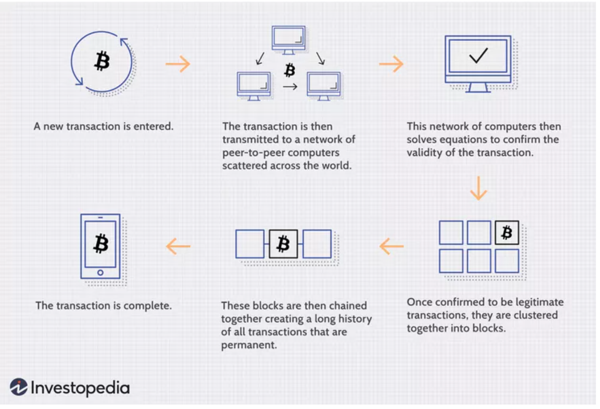
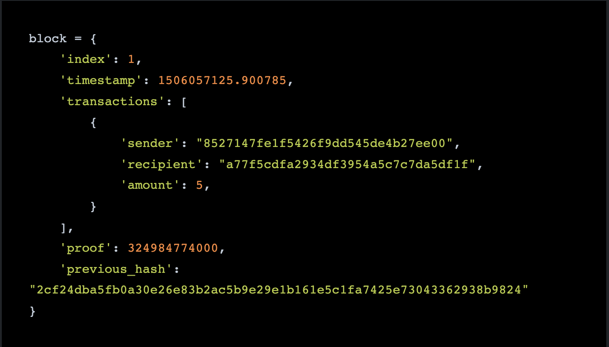

# Learning Blockchains by Bulding One

For my edification...  

## Overview of Blockchains
According to Investopedia: A blockchain is a digital database or ledger that is distributed among the nodes of a peer-to-peer network. Blocks are closed and linked to previously filled block, forming a new chain of data known as a blockchain. All new information that follows that freshly added block is compiled into a newly formed block that will then also be added to the chain once filled. Different types of information can be stored on a blockchain, but the most common use is as a ledger for transactions.

### Difference Between Database and Blockchain
Database holds its data in tables, blockchain holds data in blocks that are strung together. This makes blokchcains irreversible.

### Transaction Process

## Building the Blockchain

### Example of a Block

### Proof of Work
The algorithm used to verify the transaction and create a new block in the blockchain. Bitcoin uses SHA-256 for hashing.
For this build:  
- Find a number p' such that hash(pp') contains leading 4 zeroes, where p is the previous proof
- p is the previous proof
- p' is the new proof
To mimic the consensus validation more closely, we can adjust the difficulty of mining a block by adjusting the target value. More leading zeroes increases the mining difficulty while havingless decreases it. A higher difficulty means more hashing is required for a valid proof of work. See chainwork calculation explained later. This [answer](https://www.quora.com/Why-is-difficulty-measured-in-hash-s-leading-zeroes) gives a good explanation for why leading zeroes is used.

### More Details on SHA256 Encryption
SHA256 returns a 256-bit number in hexadecimal form. Moreover, it will return a string of 64 characters, each of which is a hexadecimal digit (0-9 and a-f). This is a convenient way to represent the hash, as it can be easily stored and transmitted as a string of characters rather than a raw binary value.  

Why 64 characters?  
Each character in a hexadecimal representation represents 4 bits of information. Since SHA-256 produces a hash with 256 bits of information, it requires 64 hexadecimal digits to represent the full hash value.

Why does each character represent 4 bits of information?  
Each character in a hexadecimal representation represents 4 bits of information because there are 16 possible values for each digit (0-9 and a-f), and 16 is equal to 2 to the power of 4 (16 = 2^4). Since each hexadecimal digit can represent 4 bits, it takes two digits to represent 8 bits (a byte), and 64 digits to represent the full 256-bit output of the SHA-256 hash function.

### Blockchain API
There will be 3 methods:
1. /transactions/new to create a new transaction to a block
2. /mine to tell our server to mine a new block
3. /chain to return the full Blockchain
Example request for a transaction:

### [Consensus](https://learnmeabitcoin.com/technical/longest-chain)
A conflict occurs when one node has a different chain to another node. Resolution is that the longest chain is authoritative. The "longest chain" refers to the blockchain that has taken the most ENERGY to build; this is not necessarily the same as the chain with the most blocks. To calculate chainwork, find how many hashes would be needed to be performed to mine each block in the chain and add them up. Average expected number of hashes for each block depends on what the [TARGET](https://learnmeabitcoin.com/technical/target) was at the time.

#### Chainwork Calculation
To calculate the number of hashes to be performed on each block based on the target:
hashes = 2^256 / (target + 1). When a hash is performed, the hash function spits out a 256-bit number.
To mine this block on the chain, this hash result must be below the target value for that particular height
on the chain. Thus, to find how many hashes are needed to be performed (on average) to get below this value, you divide the maximum range of numbers by the number you want to get below. This calculation is actually just derived from the concept of "expected value" in statistics.     
For the worst-case scenario, say there a maximum of 50 values (1-50) and the target is 25. To guarantee that a number below 25 is found, there must be at least 25 + 1 = 26 hashes done.

#### Explanation by OpenAI ChatGPT
My proof of work algorithm which uses sha256 encryption requires two leading zeroes as its target. How many hashes, on average, would it take to find a value below this target? Explain.  

The number of leading zeroes required by your proof of work algorithm determines the difficulty of the algorithm. The more leading zeroes required, the more difficult the algorithm is to solve.

To determine the average number of hashes that would be needed to find a value below your target of two leading zeroes, we need to first calculate the probability that a given hash will have two leading zeroes. The probability of any given hash having two leading zeroes is very low, since there are a very large number of possible hashes that can be generated using sha256 encryption.

To calculate the probability, we need to consider the total number of possible hashes that can be generated using sha256 encryption, which is approximately 2^256. The number of hashes that have two leading zeroes is much smaller, since there are only 16 possible values that can have two leading zeroes (00, 01, 02, 03, etc.). Therefore, the probability that a given hash will have two leading zeroes is 16/2^256.

Using this probability, we can calculate the expected value for the number of hashes that would be needed to find a value below the target of two leading zeroes. The expected value is the average number of hashes that would be needed, assuming that the probability of finding a value below the target on each trial is constant.
In this case, the probability of finding a value below the target on each trial is 16/2^256. Therefore, the expected value is 1/ (16/2^256) = 2^256 / 16 = approximately 1.8 x 10^77 hashes.
This means that, on average, you would expect to need to generate approximately 1.8 x 10^77 hashes using your proof of work algorithm before you find a value below the target of two leading zeroes. Of course, the actual number of hashes needed may vary from this expected value, and there is always a chance that you could find a value below the target on your very first hash.  

Why are there only 16 possible values that can have two leading zeroes?  
The number of possible values that can have two leading zeroes is determined by the number of possible values for each digit in the hash. In the case of sha256 encryption, each digit in the hash is represented by a hexadecimal character, which can take on one of 16 possible values (0, 1, 2, 3, 4, 5, 6, 7, 8, 9, A, B, C, D, E, F).

Since there are two leading digits in the hash, each of which can take on one of 16 possible values, there are a total of 16 * 16 = 256 possible values for the entire hash. However, only 16 of these values have two leading zeroes (00, 01, 02, 03, etc.), so there are only 16 possible values that can have two leading zeroes.

In general, the number of possible values that can have n leading zeroes is equal to the number of possible values for each digit in the hash raised to the power of n. For example, if each digit in the hash can take on one of 10 possible values (0, 1, 2, 3, 4, 5, 6, 7, 8, 9), then the number of possible values that can have two leading zeroes is 10^2 = 100.